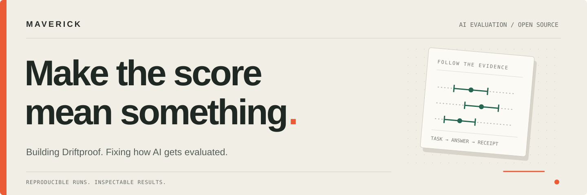

<picture>
  <source media="(prefers-color-scheme: dark)" srcset="assets/banner-dark.svg" />
  
</picture>

<a href="https://github.com/driftproofhq/driftproof"><b>↗ Driftproof</b></a> &nbsp;&nbsp;·&nbsp;&nbsp;
<a href="https://driftproofhq.com/writing/three-releases/">Writing</a> &nbsp;&nbsp;·&nbsp;&nbsp;
<a href="https://github.com/pulls?q=is%3Apr+author%3Amavericksea-ai+is%3Apublic+-org%3Adriftproofhq+-user%3Amavericksea-ai">Contributions</a> &nbsp;&nbsp;·&nbsp;&nbsp;
<a href="mailto:hello@driftproofhq.com">Get in touch</a>

I’m **Maverick**, building [Driftproof](https://driftproofhq.com) and contributing to the tools that evaluate AI models and agents.

I work on a deceptively simple question: **did the system actually measure what its score says it measured?** That has led me from missing execution evidence to inflated metrics, stale grading, and results attributed to the wrong model.

## 01 / Building Driftproof

**Agent skills change. Models change. Their evaluations should keep up.**

Driftproof runs tasks with and without a skill, samples answers and judge scores, and writes dated, hash-verified receipts. It gives you results to inspect and compare when the model underneath a skill changes.

<table>
<tr>
<td width="50%" valign="top">
<h3>Use the instrument</h3>

Evaluate a skill against a baseline and inspect the evidence behind the result.

<a href="https://github.com/driftproofhq/driftproof"><b>Explore the source →</b></a>
</td>
<td width="50%" valign="top">
<h3>Read the findings</h3>

Published runs, measurement limits, and what changed when the instrument was corrected.

<a href="https://driftproofhq.com/writing/three-releases/"><b>Three model releases later →</b></a>
</td>
</tr>
</table>

## 02 / Fixes that shipped

Selected merged contributions to projects I use and study.

| Where | Why the fix matters |
| :--- | :--- |
| **NVIDIA · SkillEvaluator** | Reading a script must not count as running it. [Require invocation evidence ↗](https://github.com/NVIDIA/SkillEvaluator/pull/154) |
| **ModelScope · EvalScope** | Unrecognized answers must not disappear from recall and F1 denominators. [Correct PubMedQA scoring ↗](https://github.com/modelscope/evalscope/pull/1828) |
| **MLflow** | Relative score checks must handle negative baselines correctly. [Use the baseline’s magnitude ↗](https://github.com/mlflow/mlflow/pull/26252) |
| **Alibaba · skill-up** | Tool argument rules need the argument structure preserved. [Fix judge matching ↗](https://github.com/alibaba/skill-up/pull/304) |
| **Addy Osmani · agent-skills** | Grades must match declared expectations and the current run. [Bind expectation IDs ↗](https://github.com/addyosmani/agent-skills/pull/576) · [Clear stale grading ↗](https://github.com/addyosmani/agent-skills/pull/587) |

More merged work in agent-skills

- [#578](https://github.com/addyosmani/agent-skills/pull/578) — Preserve on-disk edits when expanding simplify-ignore sections.
- [#598](https://github.com/addyosmani/agent-skills/pull/598), [#615](https://github.com/addyosmani/agent-skills/pull/615) — Align ADR grading and templates with the expected status and date.
- [#600](https://github.com/addyosmani/agent-skills/pull/600), [#614](https://github.com/addyosmani/agent-skills/pull/614) — Strengthen floor-guard checks for untracked files, deletions, thresholds, and diff parsing.

## 03 / Open-source activity

<!-- activity:start -->
<table>
<tr><td width="50%" valign="top"><h3>↗ Recently active · merged</h3>

<a href="https://github.com/modelscope/evalscope/pull/1828"><b>modelscope/evalscope #1828</b></a> fix(pubmedqa): include unrecognized answers in recall and F1 denominators

<a href="https://github.com/alibaba/skill-up/pull/304"><b>alibaba/skill-up #304</b></a> fix(judge): preserve tool argument structure when matching

<a href="https://github.com/mlflow/mlflow/pull/26252"><b>mlflow/mlflow #26252</b></a> Use the baseline&#x27;s magnitude in min_relative_change checks

</td><td width="50%" valign="top"><h3>◌ Under review</h3>

<a href="https://github.com/addyosmani/agent-skills/pull/667"><b>addyosmani/agent-skills #667</b></a> feat(evals): record behavioral runs for historical regrading

<a href="https://github.com/stanfordnlp/dspy/pull/10474"><b>stanfordnlp/dspy #10474</b></a> fix: read Prediction scores in BootstrapFewShot&#x27;s no-threshold acceptance check

<a href="https://github.com/EleutherAI/lm-evaluation-harness/pull/4221"><b>EleutherAI/lm-evaluation-harness #4221</b></a> perf(metrics): bootstrap binary f1 and mcc stderr from confusion counts

</td></tr>
</table>
Public external PRs · ordered by latest activity · refreshed 2026-10-10 UTC.
<!-- activity:end -->

---

**Working on agent skills or evaluation infrastructure?** I’m interested in reproducible failures, useful tools, and getting the measurement right.

[hello@driftproofhq.com](mailto:hello@driftproofhq.com) · [driftproofhq.com](https://driftproofhq.com)

Contribution statuses checked October 10, 2026.
